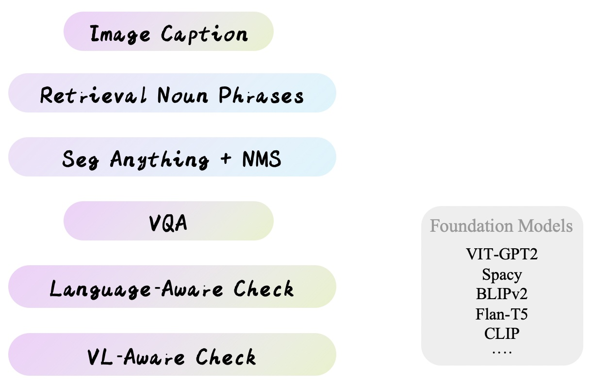

# Detect-Anything


% 

Detect-Anything(designed for practical application) is a intelligent **object detection annotation helper** who combines the capabilities of multiple foundation models including Segment Anything, BLIPv2, Flan-T5, GPT2, and even ChatBot and GPT4.


We want capture more precise texonomy for detection and instance segmentation by exploiting these AI-Large models. 

Sparing no effort to for exploitation!!! 



Coming soon...


## :bookmark_tabs: TODO
- [x] Saving COCO format
- [ ] several threshold interface


## :hammer_and_wrench: How to use


```bash
# Example: without chatgpt
export CUDA_VISIBLE_DEVICES=0
python pipeline_DA.py \
  --data_dir
  --out_dir
```


## :cupid: Acknowledgements
- [Segment Anything](https://github.com/facebookresearch/segment-anything)
- [Grounding DINO](https://github.com/IDEA-Research/GroundingDINO)
